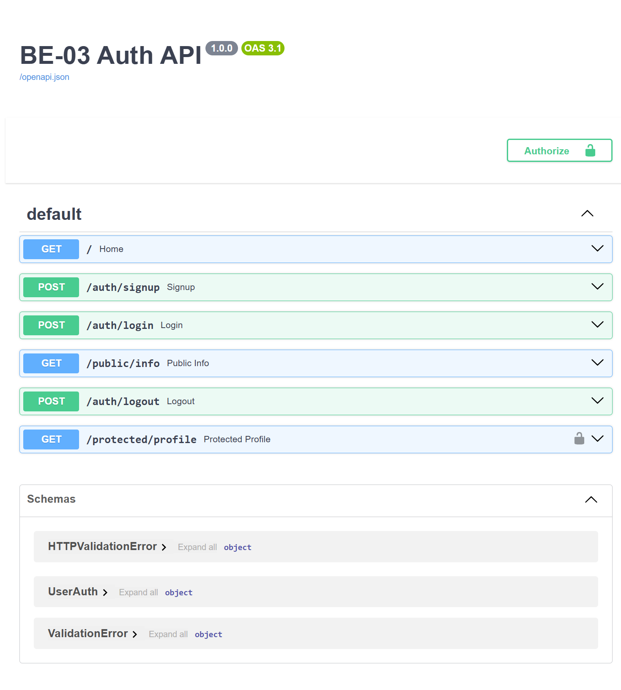

# 🔐 BE-03 Auth - Login & Protect API

A secure authentication API built with **FastAPI** and **Supabase Authentication**. This project demonstrates user authentication using JWT Bearer Tokens, reusable authentication middleware, protected routes, and interactive API testing through Swagger UI.

---

# 🚀 Features

* User Signup
* User Login
* JWT Bearer Authentication
* Protected Profile Endpoint
* Public Endpoint
* Logout Endpoint
* Reusable Authentication Middleware
* Swagger UI with Bearer Token Authorization
* Environment Variables using `.env`

---

# 🛠️ Tech Stack

* Python
* FastAPI
* Supabase Authentication
* Pydantic
* Uvicorn
* python-dotenv

---

# 📂 Project Structure

```text
flyrank-be03-auth-login-protect/
│
├── images/
│   └── swagger-ui.png
│
├── auth_middleware.py
├── main.py
├── supabase_client.py
├── requirements.txt
├── .gitignore
├── .env
└── README.md
```

---

# ⚙️ Local Setup

## 1. Clone the repository

```bash
git clone https://github.com/Misbah1l/flyrank-be03-auth-login-protect.git
cd flyrank-be03-auth-login-protect
```

---

## 2. Create a virtual environment

### Windows

```bash
python -m venv venv
venv\Scripts\activate
```

### Linux / macOS

```bash
python -m venv venv
source venv/bin/activate
```

---

## 3. Install dependencies

```bash
pip install -r requirements.txt
```

---

## 4. Create a `.env` file

```env
SUPABASE_URL=YOUR_SUPABASE_URL
SUPABASE_KEY=YOUR_SUPABASE_ANON_KEY
```

> **Important:** Never commit your `.env` file to GitHub.

---

## 5. Run the application

```bash
uvicorn main:app --reload
```

The API will be available at:

```
http://127.0.0.1:8000
```

Swagger UI:

```
http://127.0.0.1:8000/docs
```

---

# 📚 API Reference

| Method | Endpoint             | Authentication | Description                        |
| ------ | -------------------- | -------------- | ---------------------------------- |
| GET    | `/`                  | ❌ No           | Home route                         |
| POST   | `/auth/signup`       | ❌ No           | Register a new user                |
| POST   | `/auth/login`        | ❌ No           | Login and receive JWT tokens       |
| POST   | `/auth/logout`       | ❌ No           | Logout current user                |
| GET    | `/public/info`       | ❌ No           | Public endpoint                    |
| GET    | `/protected/profile` | ✅ Bearer Token | Returns authenticated user profile |

---

# 🔑 Authentication

1. Register using **POST /auth/signup**
2. Login using **POST /auth/login**
3. Copy the returned **access_token**
4. Open **Swagger UI**
5. Click the **Authorize** button
6. Paste the access token
7. Click **Authorize**
8. Test **GET /protected/profile**

---

# 📸 Swagger UI

The project includes FastAPI's interactive Swagger documentation with Bearer Token authentication enabled.

## Swagger Documentation



---

# ✅ Status Codes

| Status Code | Meaning                                 |
| ----------- | --------------------------------------- |
| 200         | Successful request                      |
| 201         | User created successfully               |
| 204         | Logout successful                       |
| 400         | Missing or invalid request data         |
| 401         | Unauthorized / Invalid or expired token |

---

# 🔒 Security

* Uses Supabase Authentication
* JWT Bearer Token verification
* Protected endpoints secured through reusable middleware
* Environment variables stored in `.env`
* `.env` excluded from Git using `.gitignore`

---

# 👩‍💻 Author

**Misbah Saeed**

Backend AI Engineering Intern — FlyRank

GitHub: https://github.com/Misbah1l

Repository:
https://github.com/Misbah1l/flyrank-be03-auth-login-protect
